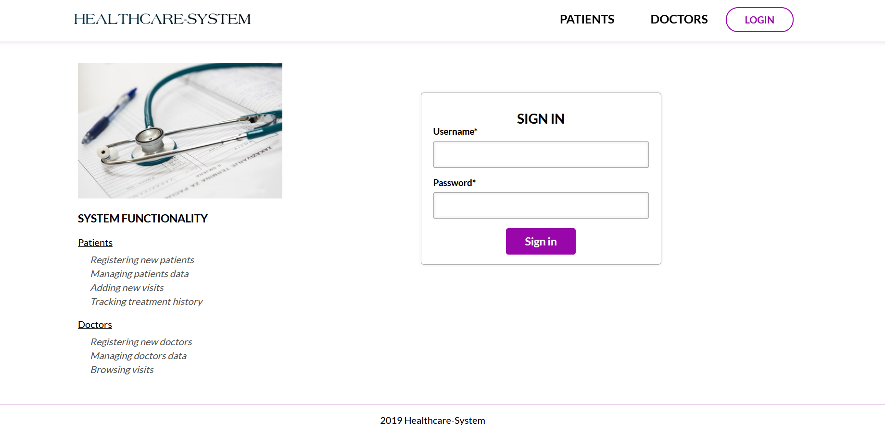
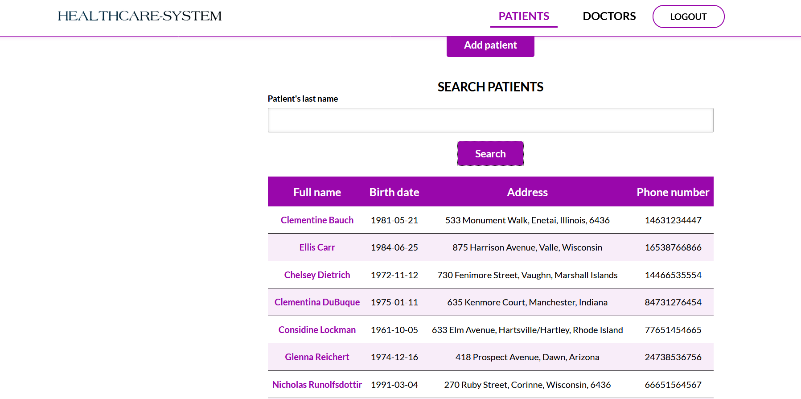
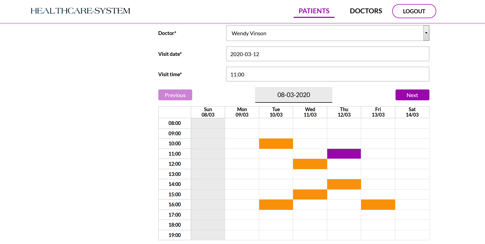

# Healthcare System

Web application allowing to manage data of patients and doctors of a health care centre.

## Table of contents

* [General info](#general-info)
* [How to start](#how-to-start)
* [Technologies](#technologies)
* [Architecture](#architecture)
* [Features](#features)
* [Screenshots](#screenshots)

## General info

Healthcare System is a web application that allows you to manage data of patients and doctors
of a health care centre. It also enables scheduling visits for patients. This app exposes RESTful API
secured with Spring Security and JWT. The front of the application is created with React and Redux.

## How to start

Clone the repository to your local machine using `https://github.com/ljurak/expense-manager.git`.
At first you have to install backend of the application. Starting from the root folder of the app
```bash
cd rest
mvn clean package
cd target
java -jar rest.jar
```
Once you have started backend, move to the root folder and install front of the application.
```bash
cd front
npm install
npm start
```
The app will start on http://localhost:3000

## Technologies

Project is created with:
* Java 11
* Spring Boot
* Spring Data
* Spring Security
* JWT
* Hibernate
* React
* Redux
* React Router
* Formik

## Architecture

Application is divided into four main modules. Classes in each module has package-scope. Operations
required by other modules are exposed through a facade.

## Features

* Registering patients and doctors
* Searching for patients and doctors
* Making appointments for patients
* Browsing history of visits

## Screenshots


Login page


Patients search results


Registering visit